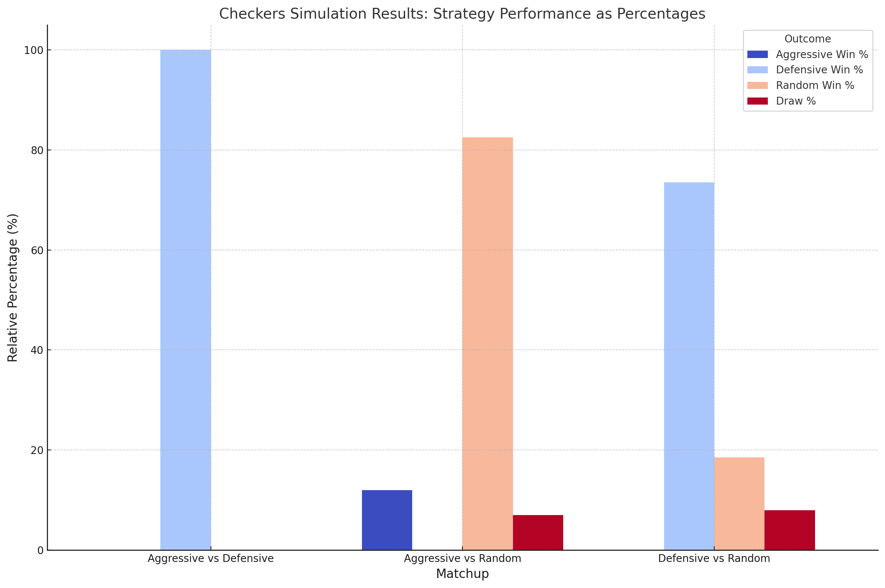

# 2024F CS2910 Project Report
**Group Members**
1. James Akhator (352393)

# Summary of Game
The game i chose is called checkers or draught it is a two player strategy 
board game.The goal is to capture all of the opponent's pieces or block them so they cannot make a valid move.
Each player moves their pieces across the board diagonally in turn. A piece can advance one square at a time with regular pieces, but capturing an opponent's piece requires hopping over it.
A piece is "kinged" when it reaches the final row on the opposing side, allowing it to travel both forward and backward. When one player blocks or destroys every piece of the opposition, the game is over.
the game can be found at https://en.wikipedia.org/wiki/Checkers
# Experiment Report
## Player Strategies
_For each of 3 strategies you implemented, name the strategy, and then description of it (100 words each)_
1. Random Strategy:
   My Random Strategy chooses a random, valid move for the current player from among the available moves. Instead of giving priority to any one move, it just chooses one at random. In this technique, a list of acceptable
move provided by the board is used to produce an index that corresponds to a legitimate move using the Random class. Despite its simplicity and lack of depth in decision-making, it provides a fundamental strategy for the game. Because the Random Strategy ignores piece posture, capture potential, and other tactical considerations, it is very unpredictable.
2. Aggressive Strategy:
   The goal of my aggressive strategy is to optimize the player's attacking movements. Capturing enemy pieces is its first priority, and it values capturing higher-value pieces like Kings in particular. Each valid move is assessed by the strategy, which gives moves that lead to a capture greater values. It favors moving pieces closer to promotion when there are no captures available. The strategy is
aggressive and risky because it ignores dangers to the player's own pieces. Because defensive concerns are never taken into account while making decisions, it may leave the player open to counterattacks .
3. Defensive Strategy:
   The defensive strategy that I used puts the player's pieces' safety ahead of attacking moves. It checks the risks of non-capturing movements after searching for capturing moves but failing to find any. In order to determine possible threats from opponent pieces, this strategy uses a risk-assessment methods. It seeks to select the move that keeps the player's pieces out of danger zones and out of places where they may be captured. Compared to the aggressive method, this technique is more conservative since it places more emphasis on protecting pieces and avoiding needless risks. It's very helpful while playing the game defensively and strategically.

   
## Procedure
**Classes Involved and Their Roles**

**Game Class:** It controls the flow of the game,  manages the turn-taking mechanism, alternating between two players, and ensures that moves are executed according to the rules. It interacts with the Board class to update the game state after each move. The class also checks for game-ending conditions: when one player has no valid moves left or when a player has won by capturing all of the opponent’s pieces.

**Board Class:** it represents the 8x8 grid that makes the checkers board. It stores pieces in an array and has methods for interacting with these pieces, including placing and removing them. The board has methods such as getValidMoves shows the legal moves for a piece), executeMove (which carries out a move), and applyMove (which updates the board after a move).

**Piece Class and Its Subclasses (RegularPiece, KingPiece):** The Piece class is abstract and represents a checkers piece. Each piece has a color (Black or White).

**Player Class:**  Represents the players, each of whom has a chosen strategy (Aggressive, Defensive, or Random).

**Strategy Interface and Implementations:** Strategy Interface: This defines the decideMove method, which each strategy must implement. The method returns a Move object, representing the next move the player should make based on the given strategy.

**Running the Game and Class Tests**

**GameTest:** The game test sets up the board and assigns players with different strategies (Aggressive, Defensive, or Random). It runs multiple trials where each player's move is determined by their assigned strategy. The game alternates between players, executing valid moves while adhering to the rules for capturing and promotion. The simulation tracks the outcome of each trial, recording the number of wins, losses, and draws for each strategy to analyze their performance over repeated games.

**Board Tests:** The board test verifies the correct functionality of the Board class by checking piece placement, valid move generation, and boundary conditions. It ensures that pieces are placed, moved, and captured accurately.

**Strategies Tests:** it checks the decision-making capabilities of each strategy class (Random, Defensive, and Aggressive). These tests check different game scenarios, ensuring that the strategies select valid moves based on their unique behaviors, such as prioritizing captures for the aggressive strategy or avoiding threats for the defensive strategy.

## Results

Aggressive, defensive, and random strategies were assessed in a simulation of 20 games that were repeated over ten trials in a variety of matches. With a 100% victory record, DefensiveStrategy outperformed AggressiveStrategy, demonstrating its ability to reduce risks and keep control, whereas AggressiveStrategy was unable to pick up any victories. AggressiveStrategy only managed a 10% win rate against RandomStrategy's 80% win rate with 10% draws, demonstrating how randomness may take advantage of the aggressive approach's predictability. With a 72.5% victory rate, RandomStrategy's 22.5%, and 5% draws, DefensiveStrategy also surpassed RandomStrategy, proving that a well-thought-out defensive strategy constantly adjusts and overcomes unpredictability.

## Analysis
The testing findings show that the Aggressive Strategy always performs the worst. The main goal of this strategy is to push toward the other end of the board by capturing opponent pieces. But in Checkers, keeping a strong backline is one of the most important factors. Aggressive moves often disrupt the defensive position, leaving pieces vulnerable to attacks or counter attacks. Although it may appear promising at first, the aggressive strategy pushes players to make risky captures, which leaves them in an exposed position that is readily countered by more defensive tactics.
The Defensive Strategy, on the other hand, is concentrated on lowering risk and preserving a solid, safe position. The protection of its pieces is given first priority in this approach, which places them in positions that make them less vulnerable to capture. It seeks to keep control of the backline and steer clear of pointless involvement. In almost all instances, the Defensive Strategy performs better than the Aggressive Strategy because of the nature of Checkers, where maintaining a solid defense is frequently the key to success. Because it successfully avoids dangerous circumstances and secures its pieces, the Defensive Strategy outperforms the Aggressive and Random Strategies.
Since the RandomStrategy chooses movements at random from a range of viable choices, it is by its very nature unpredictable. Its performance is affected by Checkers' imposed capture rule, which states that pieces must eventually be captured if at all possible, even if it does not actively prioritize any one approach. Because the Aggressive approach tries to expose its pieces by aggressively advancing them, this approach generally performs better than the Aggressive Strategy despite its unpredictability. With its focus on pushing and capturing, the aggressive strategy frequently exposes its pieces to counterattacks and needless risks, giving the opponent the opportunity to take advantage of these weaknesses. However, RandomStrategy gains from the possibility that it would unintentionally avoid potentially dangerous moves that AggressiveStrategy would otherwise perform. The RandomStrategy occasionally stays in a safer formation since it doesn't actively aim to advance units into risky situations, which makes it more difficult for the opponent to capture pieces.
Based on the results, it is clear that DefensiveStrategy regularly outperforms AggressiveStrategy, which struggles because of its excessive focus on offensive operations, while DefensiveStrategy wins most of its encounters. Depending on the opponent's movements and the board situation, the RandomStrategy is less reliable and alternates between victories and losses. While Aggressive strategy struggles to pick up wins because of how vulnerable its pieces always lie

# Reflection

### What generative AI did you use, and what tasks did you use it for?
I used ChatGPT and Copilot for different parts of this project. ChatGPT was helpful for generating base codes and starting points, debugging code, and assisting in visualizing results with graphs. GitHub Copilot provided in-line suggestions while writing Java code, helping to accelerate coding tasks such as implementing getters and setters and optimizing methods.

### How did you learn about the tools used by your group (delete ones that don't apply)?
I learned about ChatGPT through personal exploration and recommendations as an all-in-one tool for technical and creative problem-solving. GitHub Copilot was introduced to me through TikTok when I was searching for projects that I could do to help boost my portfolio and resources to assist me whilst I am doing them

### Reflection on Experience with Generative AI
The use of generative AI in this project was filled with its ups and downs it created an interesting environment that shows how it may help with a range of tasks. Some of the huge benefits I got from using generative AI include faster processes and answers when I ran into problems or got stuck. However, it soon became clear that using AI successfully required a thorough understanding of the work at hand and being able to create specific instructions. Although the AI can provide code, logic, or concept suggestions, the user is still ultimately responsible for debugging and core functionality.
One important finding was that generative AI usually ignores the project's larger Goal. It could offer suggestions that are too general or without any basis and don't fit the needs of the system. For example, it sometimes recommended bits of code that, if mindlessly applied, would have led to serious problems or even destroyed the project. This underscored just how important it is to have the core knowledge because the AI cannot take the position of basics needed to verify, modify, and troubleshoot its recommendations.
Generative AI also has a lot of advantages in spite of these difficulties. By taking care of time-consuming or repetitive tasks and offering quick solutions to issues, sped up and improved the speed of the work. By providing different viewpoints and solutions that generated fresh ideas, it was very useful in overcoming deep-rooted bugs where standard problem-solving wasn't cutting it. However, the speed and creativity it offered came with the catch that the user must always analyze and scrutinize the AI’s output.
To sum up, generative AI was a key and useful tool for my project, providing needed assistance and making the whole process faster. However, successful collaboration with AI requires a deep and rooted understanding of the subject matter. AI may provide a lot of recommendations, but mistakes may arise if the skills to assess and troubleshoot them are lacking. The best outcomes can come from a combination of a person’s in-depth knowledge and the AI’s broad, adaptable capabilities. This combination of technology and experience produces an effective chemistry that makes creative and practical solutions possible.

# Bonus Consideration:
My Defensive Strategy because it has deep logic that combines multiple methods for informed decision-making. The decideMove method checks valid moves, prioritizing captures via getBestCaptureMove, which replicates how the future board will look to minimize risk. If no captures are available, the getSafestMove selects the least risky non-capturing move. Using calculateRisk and countOpponentThreats, it checks the threats by simulating opponent strategies. 